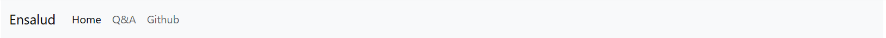

# Entrevista Técnica Ensalud

```sh
Guillermo Fernández
```

### Features
- Responsive design
- Navbar mobile y desktop
- Vista de Post por usuario seleccionado
- Vista de comentarios por post a través de un modal
- Vista de edición de usuario con precarga de datos
- Capacidad de subir una imagen jpg
- Capacidad de subir un pdf
- Almacenamiento de archivos en servidor
- Actualización de datos sin recarga de pagina
- Toast de notificación de success / error

### Link Demo
<a href='https://ensalud.bemy.com.ar' target="_blank">ensalud.bemy.com.ar</a>

### Scheme database
<p>
  
  
</p>

### Capturas de proyecto

<p align='center'>
  
  
  
  
      
  
  
</p>
